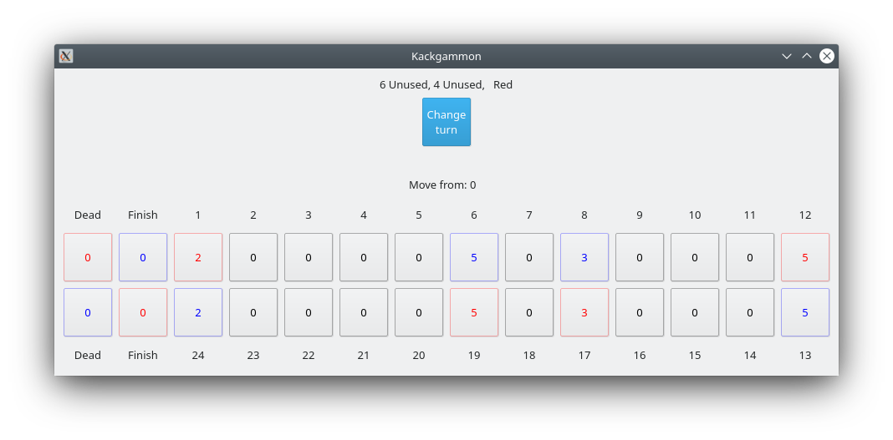

# Kackagammon
Backgammon written in C++ and the Qt toolkit
<h1 align="center">
  
   
</h1>

## Building

### Prerequisites
Generally only the following 3 prerequisites should be required (for building on \*nix):

1. CMake
2. make
3. C++ compiler
4. Qt5 C++ bindings

On Arch Linux this translates to

    pacman -S cmake make gcc qt5-base

### Preparing and building
The following should be sufficient to build the project (assuming the use of makefiles with CMake):

    cmake .
	make

Which should produce a binary called `Kackgammon` in the root directory of the project

### Tested versions
This project has been tested with 
	
	cmake version 3.17.3
	GNU Make 4.3
    g++ (GCC) 10.1.0
	Qt version 5.15.0

